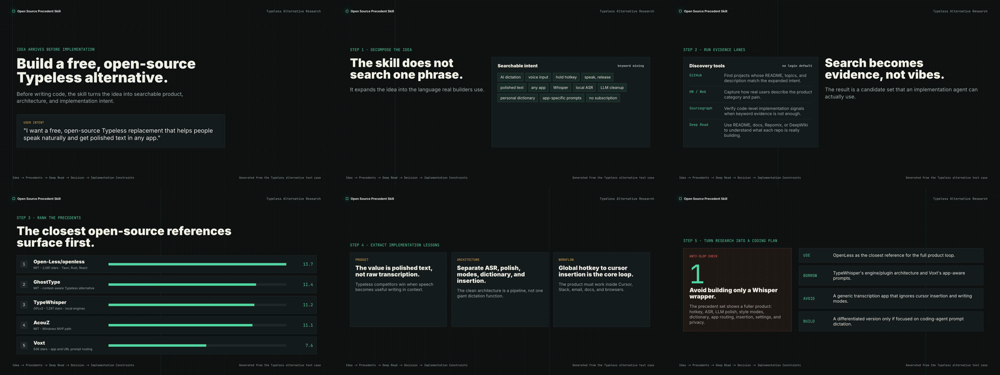

# Steal the Code

[](https://skills.sh/lumpinif/steal-the-code)

Ask your agent to steal the code first, then build something better.

Steal the Code is a skill for agentic coding. Before an agent designs or builds
a product, feature, module, system, or another skill, it finds real public
open-source precedents, studies what works, and turns that evidence into a
practical implementation plan.

This is not about stealing private code or ignoring licenses. It is about making
agents learn from public builders instead of inventing worse versions of things
that already exist.

## Why You Need It

- **Problem**: agents can code well, but still make weak product, architecture,
  and workflow decisions.
- **Missing context**: the agent only sees your prompt and current codebase,
  while the best public precedents are scattered across repos, skills, docs,
  launches, and community threads.
- **Fix**: make the agent study those precedents before it builds.
- **Result**: better product instincts, cleaner architecture, proven patterns,
  clear things to avoid, and a higher chance of building something better.

## Install

```bash
npx skills add lumpinif/steal-the-code
```

Use without installing:

```bash
npx skills use lumpinif/steal-the-code@steal-the-code
```

## What It Does

Steal the Code is a precedent pipeline for coding agents.

1. **Decompose the idea**  
   Turns a vague request into product, workflow, architecture, implementation,
   analogy, and negative keywords. This prevents the agent from searching one
   weak phrase and missing the real category.

2. **Mine real-world language**  
   Uses skills, GitHub, Hacker News, docs, and public web signals to learn how
   builders and users describe similar problems.

3. **Find public precedents**  
   Uses no-login tools first: open-source alternative directories for seed
   candidates, GitHub public repo search for repositories, Sourcegraph public
   search for code-level evidence, HN Algolia for community signals, and
   skills.sh for existing agent workflows.

4. **Rank by practical fit**  
   Re-ranks candidates with BM25-style local keyword matching and evidence
   review. Fit to the user's workflow and implementation shape matters more
   than stars.

5. **Deep-read the winners**  
   Reads the best repos with README/docs, raw GitHub files, Repomix, DeepWiki,
   or local code search to understand what the project is really doing.

6. **Turn evidence into a build decision**  
   Produces `Use / Borrow / Avoid / Build New`, credits and license notes, and
   concrete constraints for the next coding step. Optional outputs include an
   HTML dashboard, a short precedent reel, and candidate JSON.

## Optional Outputs

The default output is a concise chat brief. When the result is worth sharing or
handing off to another agent, Steal the Code can also produce richer artifacts.

- **HTML Dashboard**: a single local HTML file that compares candidates by fit,
  source, license, platform, takeaways, and `Use / Borrow / Avoid / Build New`.
  Use this when you want a durable visual brief for yourself, a team, or another
  agent.
- **Precedent Reel**: a short HyperFrames or Remotion video that turns the same
  report into a shareable walkthrough. The agent chooses HyperFrames for fast
  HTML-first reels and Remotion for React-first reusable video systems.
- **Candidate JSON**: the source of truth for the brief, dashboard, and reel, so
  later agents can continue from the same evidence instead of rerunning the
  research from scratch.

## Core Principle

Steal ideas. Credit builders. Respect licenses. Build better.

## Example Showcase

The Typeless alternative example can be turned into a visual report and a short
video.

- [Open the Typeless HTML Dashboard](https://lumpinif.github.io/steal-the-code/typeless-report.html)
- [Open the Examples Page](https://lumpinif.github.io/steal-the-code/)

[](assets/typeless-precedent-reel.mp4)

Click the preview to open the MP4. GitHub README files do not reliably render
repo-hosted videos inline, so the screenshot acts as a stable preview.

## Example

Intent:

```text
Build a free, open-source Typeless alternative.
```

Product reference:

- [Typeless](https://www.typeless.com/)

The skill expands the idea into query families:

```text
AI dictation
voice input in any app
hold hotkey, speak, release
polished text
Whisper / local ASR
LLM cleanup
personal dictionary
app-specific prompt routing
no subscription
```

It finds projects such as:

- [Open-Less/openless](https://github.com/Open-Less/openless)
- [TypeWhisper/typewhisper-mac](https://github.com/TypeWhisper/typewhisper-mac)
- [hehehai/voxt](https://github.com/hehehai/voxt)
- [never13254/GhostType](https://github.com/never13254/GhostType)
- [DoodzProg/AcouZ](https://github.com/DoodzProg/AcouZ)

Then it turns the precedent set into a coding recommendation:

- Use [OpenLess](https://github.com/Open-Less/openless) as the closest
  full-product reference.
- Borrow [TypeWhisper](https://github.com/TypeWhisper/typewhisper-mac)'s local
  engine/plugin direction.
- Borrow [Voxt](https://github.com/hehehai/voxt) and
  [GhostType](https://github.com/never13254/GhostType)'s app-aware prompt
  routing.
- Reference [AcouZ](https://github.com/DoodzProg/AcouZ) for a minimal Windows
  path.
- Avoid building only a Whisper wrapper.
- Build new only with a clear differentiated focus.

## No-Login Default Toolchain

The default workflow prefers tools that an agent can run without user login or
API keys:

- GitHub public repository search
- GitHub public contents/raw APIs
- Public open-source alternative directories
- Hacker News Algolia API
- Sourcegraph public Stream API
- Repomix
- DeepWiki MCP when available
- Local BM25-style candidate ranking

API-key tools such as Exa, Tavily, Firecrawl, and Reposeek can be used as
enhancements, but they are not required.

## Scripts

The scripts are dependency-free Node.js tools for agents.

```bash
node scripts/oss-directory-search.mjs "notion" --limit 10
node scripts/github-repo-search.mjs "open source typeless alternative AI dictation" --limit 10
node scripts/hn-search.mjs "Typeless open source dictation" --limit 10
node scripts/sourcegraph-search.mjs '"global hotkey" "transcribe" "paste" lang:Swift count:20'
node scripts/rank-candidates.mjs --query "free open source typeless alternative AI dictation" --input examples/typeless-candidates.json --fetch-readme
node scripts/render-html-report.mjs --input examples/typeless-report.json --out outputs/typeless-report.html
```

Directory results are seed leads, not proof. Before using a candidate, verify
its GitHub repository, license, maintenance recency, README/docs, and code-level
evidence.

## Responsible Use

Steal the Code should always surface:

- The source projects used.
- The relevant license for each repo.
- Whether direct code reuse is license-compatible.
- What should be credited in docs, README, or release notes.
- What should be borrowed as an idea instead of copied as code.

If an agent borrows code directly, it must preserve required attribution and
follow the license terms. If license compatibility is unclear, treat the project
as inspiration only until a human verifies it.

## Repository Layout

```text
SKILL.md
references/
  toolchain.md
  output-modes.md
  credits-and-licenses.md
templates/
  precedent-report.schema.json
scripts/
  oss-directory-search.mjs
  github-repo-search.mjs
  hn-search.mjs
  sourcegraph-search.mjs
  rank-candidates.mjs
  render-html-report.mjs
examples/
  typeless-candidates.json
  typeless-report.json
docs/
  index.html
  typeless-report.html
```
